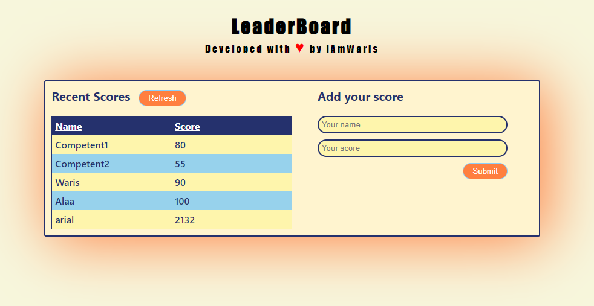

# Leaderboard: setup project

> In this repo I am setting up the Leaderboard project.

I am configuring the GitFlow, webpack, and linters in this stage and will write basic HTML and CSS necessary for the project.

## Built With

- HTML
- CSS
- JavaScript
- webpack
- -GitFlow

## Live Demo

[Live Demo Link](https://iamwaris97.github.io/Leaderboard/)

## Getting Started

>To get a local copy of this project follow the following steps:

-Clone this repository with

<code>git clone https://github.com/iAmWaris97/Leaderboard</code> using your terminal or command line.

-Change to the project directory by entering:

<code>cd Leaderboard</code> in the terminal.

-run <code>code . </code>to open it in VSCode

## Author:

👤 **Waris Haleem**

- GitHub: [@iAmWaris97](https://github.com/iAmWaris97)
- Twitter: [@iAmWaris97](https://twitter.com/iAmWaris97)
- LinkedIn: [Waris Haleem](https://www.linkedin.com/in/waris-haleem/)

## 🤝 Contributing

Contributions, issues, and feature requests are welcome!

Feel free to check the [issues page](https://github.com/iAmWaris97/Leaderboard/issues).

## Show your support

Give a ⭐️ if you like this project!

## Acknowledgments

- Design inspiration by:
- Microverse 

## 📝 License

This project is [MIT](./MIT.md) licensed.